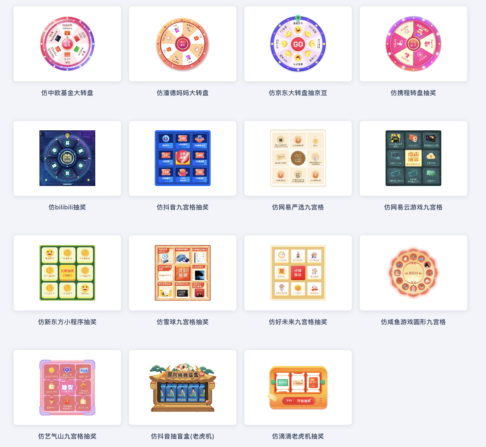
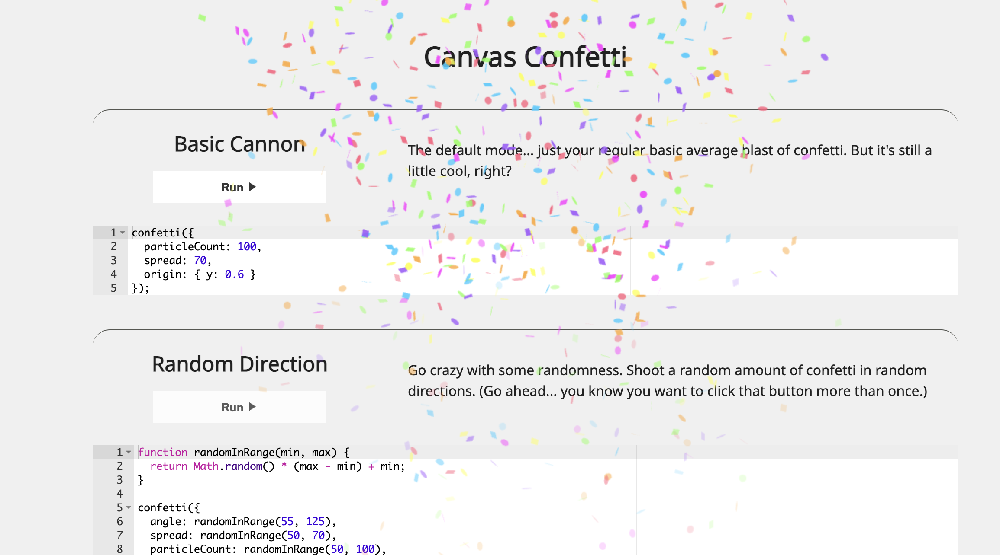

### 	1、转盘抽奖

https://100px.net/demo/more.html


### 	2、撒花🎉

https://www.kirilv.com/canvas-confetti/


###     3、动态计数效果

npm install react-countup 或者 yarn add react-countup

###     4、时间处理距离现在

import dayjs from 'dayjs'
dayjs.extend(relativeTime)

dayjs(Number(v) * 1000).fromNow()

###     5、三方客服插件
文档 https://developer.zendesk.com/documentation/zendesk-web-widget-sdks/sdks/web/getting_started/
```
export const initZendeskService = () => {
  // 引入zendesk在线客服
  const head = document.getElementsByTagName('head')[0]
  const script = document.createElement('script')
  script.id = 'ze-snippet'
  script.src = 'https://static.zdassets.com/ekr/snippet.js?key=64ddaa89-5e7a-4ce5-81f2-398fe7a61077'
  script.onload = () => {
    if (window.zE) {
      window.zE("messenger:set", "locale", getZELang())
      window.zE('messenger', 'close');
    }
  }
  head.appendChild(script)

}
```


